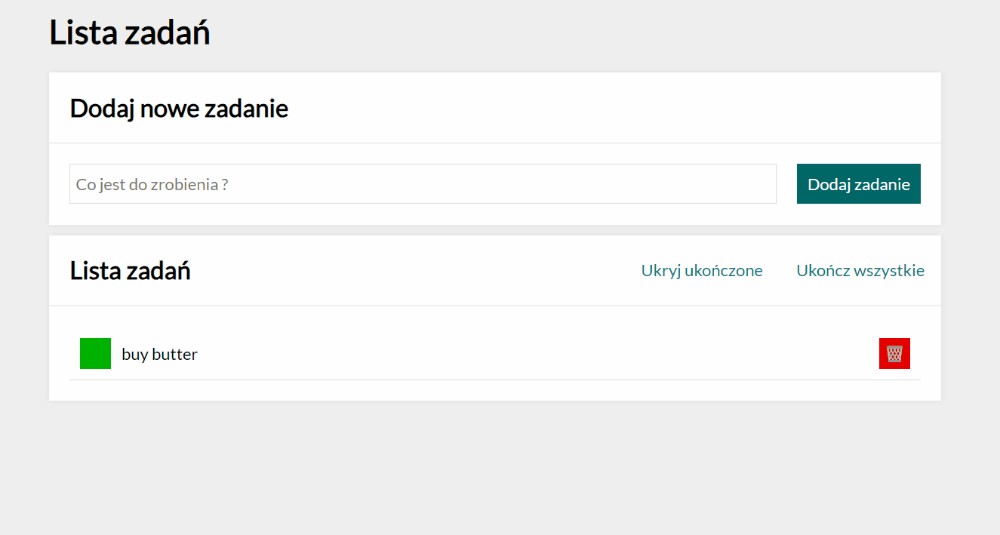

# TO DO LIST

[App](https://arkadiusz0809.github.io/Todo-list/)

## Description

This is an application that will help the user to become an organized person. The user can enter any phrase that appears below and then be able to deselect the task after it is completed. 
Then after adding the task, the user can press the "ukończ wszystkie" button and then all tasks will be crossed out.
When the task is crossed out, that is completed, use the "ukryj ukończone" button to hide tasks already done. 

Tools used:
- HTML
- JS [ ECMAScript 6]
- CSS
- BEM
- Grid
- Flex